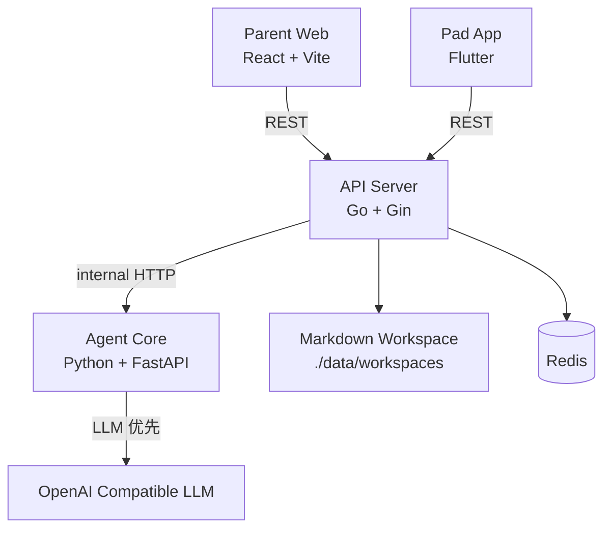

# StudyClaw 技术架构与设计蓝图

本文档描述的是仓库当前实际可运行的 `v0.1.0` 架构，而不是长期愿景架构。

## 1. 当前架构概览

`v0.1.0` 采用轻量原型架构，目标是先跑通“家长输入 -> AI 解析 -> 任务确认 -> 孩子执行 -> 进度同步”闭环。



说明：

- `Redis` 在当前版本中已可启动，但还不是主数据来源
- 任务主存储已经切换为 `Markdown Workspace`
- 如果 `LLM_API_KEY` 不可用，`Agent Core` 会自动使用规则兜底解析

## 2. 当前技术栈

### 2.1 API Server

- 语言: `Go`
- 框架: `Gin`
- 职责:
  - 接收家长端原始任务文本
  - 调用 Agent Core 做解析
  - 提供任务确认、查询、状态更新接口
  - 把任务写入和更新到 Markdown 工作区

### 2.2 Agent Core

- 语言: `Python 3`
- 框架: `FastAPI`
- 职责:
  - 解析学校群式原始任务文本
  - 输出 `学科 -> 作业分组 -> 原子任务`
  - 标记 `confidence`、`needs_review`
  - 生成周报分析结果

### 2.3 Parent Web

- 技术: `React + Vite`
- 当前能力:
  - 粘贴学校群原文
  - AI 解析预览
  - 编辑、筛选、确认创建任务
  - 查看今日任务清单

### 2.4 Pad App

- 技术: `Flutter`
- 当前能力:
  - 拉取指定日期任务板
  - 按学科与作业分组查看任务
  - 单个任务、分组、学科、全部任务的完成同步
  - 默认隐藏已完成任务，让孩子自主选择未完成任务

## 3. 当前核心数据流

### 3.1 家长输入与解析

1. 家长在 `parent-web` 粘贴学校群原始作业文本
2. `parent-web` 调用 `POST /api/v1/tasks/parse`
3. `api-server` 调用 `agent-core /api/v1/internal/parse`
4. `agent-core` 输出结构化任务建议和分析元信息
5. 家长审核后调用 `POST /api/v1/tasks/confirm`
6. `api-server` 将最终任务写入 Markdown

### 3.2 孩子完成与同步

1. `pad-app` 调用 `GET /api/v1/tasks`
2. `api-server` 从 Markdown 读取任务并构建任务板
3. 孩子勾选任务或分组
4. `pad-app` 调用状态更新接口
5. `api-server` 改写对应 Markdown 文件

## 4. 当前任务模型

当前统一采用三层结构：

1. `subject`
2. `group_title`
3. `task`

示例：

```json
{
  "subject": "英语",
  "group_title": "预习M1U2",
  "title": "书本上标注好“黄页”出现单词的音标"
}
```

这样做的原因：

- 家长端容易审核
- Pad 端适合分层展示
- Markdown 容易直接阅读和手工修正

## 5. Markdown 存储结构

任务默认写入：

```text
data/workspaces/family_<family_id>/user_<user_id>/<date>.md
```

文件结构：

```md
# 2026年03月06日 - 今日成长轨迹

## 🎯 任务清单

### 英语

#### 预习M1U2
- [ ] 书本上标注好“黄页”出现单词的音标
- [ ] 抄写单词（今天默写全对，可免抄）
- [ ] 沪学习听录音跟读
```

## 6. 当前接口

### 6.1 家长端与管理接口

- `POST /api/v1/tasks/parse`
- `POST /api/v1/tasks/confirm`
- `GET /api/v1/tasks`

### 6.2 状态同步接口

- `PATCH /api/v1/tasks/status/item`
- `PATCH /api/v1/tasks/status/group`
- `PATCH /api/v1/tasks/status/all`

### 6.3 Agent Core 内部接口

- `POST /api/v1/internal/parse`
- `POST /api/v1/internal/analyze/weekly`

## 7. 环境变量

当前主要使用这些变量：

```env
API_PORT=8080
AGENT_PORT=8000
AGENT_CORE_URL=http://localhost:8000
LLM_BASE_URL=https://api.openai.com/v1
LLM_API_KEY=sk-xxxx
STUDYCLAW_DATA_DIR=./data
```

说明：

- `DB_*` 变量当前仅保留，不参与 `v0.1.0` 主流程
- `STUDYCLAW_DATA_DIR` 不设置时，默认使用仓库根目录下的 `data/`

## 8. 当前边界与后续演进

`v0.1.0` 明确不做这些事情：

- 不做 MySQL 作为主存储
- 不做 WebSocket
- 不做 OCR / 图片作业解析正式链路
- 不做情绪识别和传感器能力
- 不让系统强制决定孩子的任务顺序

后续演进方向见 [docs/03_ROADMAP.md](/Users/admin/Documents/WORK/ai/studyclaw/docs/03_ROADMAP.md)。
