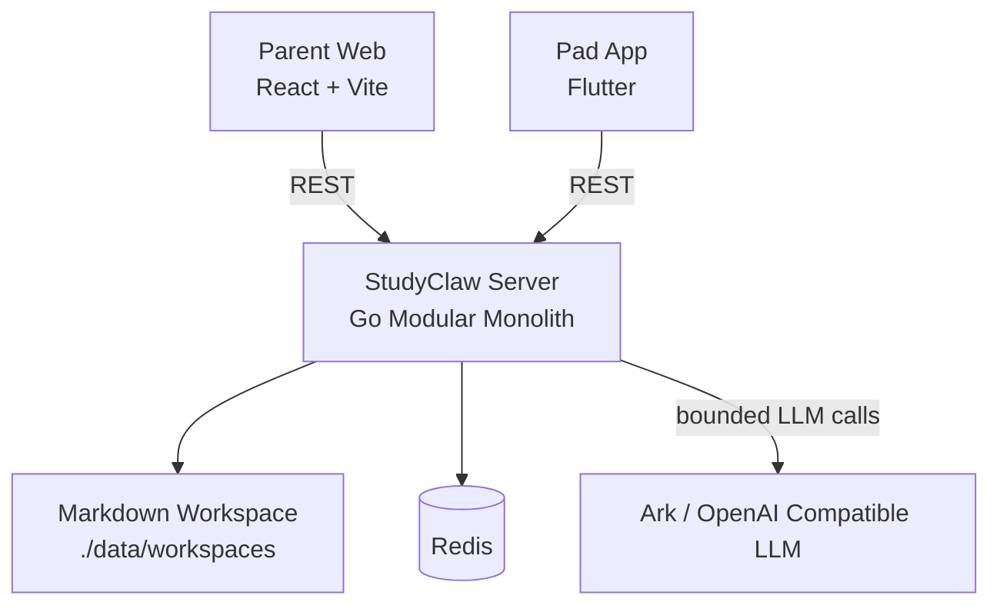

# StudyClaw 技术架构

本文档描述 `2026-03-09` 之后仓库当前的真实架构。核心结论是：`Flutter + React` 保持不变，后端运行态收敛为 `Go` 单体后端，原先的 Python 实现已完成迁移并移除。

## 1. 总体架构



说明：

- 当前只有一个后端进程需要运行：`apps/api-server`
- 任务板主存储是 Markdown 工作区（`internal/modules/taskboard/infrastructure/markdown`）
- Phase 1 结构化数据（draft/assignment/points/wordlist/dictation）使用 JSON 状态文件（`internal/modules/taskboard/infrastructure/jsonstore`）
- Redis 当前仍是辅助组件，不是主数据源
- LLM 通过 OpenAI 兼容接口接入，默认支持 Ark Base URL

## 2. Go 后端目录设计

`apps/api-server` 采用 Go 常见大型项目目录组织方式：

```text
apps/api-server/
├── cmd/studyclaw-server/
├── internal/
│   ├── app/
│   ├── interfaces/http/
│   ├── modules/
│   │   ├── agent/
│   │   │   ├── taskparse/
│   │   │   └── weeklyinsights/
│   │   └── taskboard/
│   │       ├── application/
│   │       ├── domain/
│   │       └── infrastructure/markdown/
│   ├── platform/llm/
│   └── shared/agentic/
├── routes/
└── services/
```

职责分层：

- `cmd`: 可执行入口
- `internal/app`: 依赖装配和容器
- `internal/interfaces/http`: HTTP 协议层
- `internal/modules/taskboard`: 任务领域逻辑和存储
- `internal/modules/agent/*`: LLM / agent 能力模块
- `internal/platform/llm`: 供应商适配
- `routes` / `services`: 兼容旧调用的薄封装

## 3. 核心数据流

### 3.1 家长输入与任务创建

1. 家长端调用 `POST /api/v1/tasks/parse`
2. `taskparse` 模块先做结构提取和规则拆解
3. 若配置了 LLM，则发起一次有边界的语义解析调用
4. 服务合并规则结果与 LLM 结果，返回候选任务
5. 家长确认后调用 `POST /api/v1/tasks/confirm`
6. `taskboard` 模块把任务写入 Markdown

### 3.2 孩子执行与任务板同步

1. Pad 端调用 `GET /api/v1/tasks`
2. `taskboard` 从 Markdown 读取任务
3. 应用服务构建 `groups`、`homework_groups`、`summary`
4. Pad 端调用状态更新接口
5. `taskboard` 改写对应 Markdown 文件

### 3.3 周度观察

1. 客户端调用 `GET /api/v1/stats/weekly`
2. 后端聚合近 7 天 Markdown 任务数据
3. `weeklyinsights` 先做确定性统计
4. 若配置了 LLM，则用单次总结调用生成儿童友好摘要

## 4. Agentic Design Pattern 选型

参考：

- `https://docs.cloud.google.com/architecture/choose-design-pattern-agentic-ai-system`

当前实现采用的模式如下：

### 4.1 作业解析 `taskparse`

- 主模式: `custom logic pattern`
- 辅助模式: `single-agent system`
- 辅助模式: `human-in-the-loop pattern`

原因：

- 输入格式噪声大，但业务输出必须稳定
- 任务归一化、去重、低置信度标记必须由确定性代码负责
- 最终创建动作必须由家长确认

### 4.2 周报分析 `weeklyinsights`

- 主模式: `single-agent system`
- 辅助模式: `custom logic pattern`

原因：

- 周报本质是单轮总结任务
- 指标汇总先由 Go 完成，LLM 只负责自然语言总结
- 当前完全没有必要引入多智能体编排

### 4.3 任务板与状态同步 `taskboard`

- 不使用 Agent

原因：

- 这是标准的领域服务和存储问题
- 任务状态必须可预测、可测试、可回放

## 5. 运行时配置与安全边界

主要环境变量：

```env
API_PORT=8080
LLM_BASE_URL=https://ark.cn-beijing.volces.com/api/v3
LLM_API_KEY=...
LLM_MODEL_NAME=...
LLM_PARSER_MODEL_NAME=...
LLM_GRADER_MODEL_NAME=...
LLM_WEEKLY_MODEL_NAME=...
LLM_HTTP_TIMEOUT_SECONDS=90
STUDYCLAW_DATA_DIR=./data
STUDYCLAW_LOG_DIR=./data/logs
```

边界要求：

- 真实密钥保存在仓库外 `runtime.env`
- 浏览器端和 Flutter 端绝不直接持有后端密钥
- `.env.example` 只保留示例配置

## 6. 迁移完成状态

原先 Python `agent-core` 中承担的能力已经全部迁移到 Go：

- 应用入口与环境加载
- 内部解析接口
- 内部周报接口
- LLM 配置与 OpenAI 兼容调用
- 作业解析规则兜底与 LLM 混合解析
- 周报 mock 回退与 LLM 摘要
