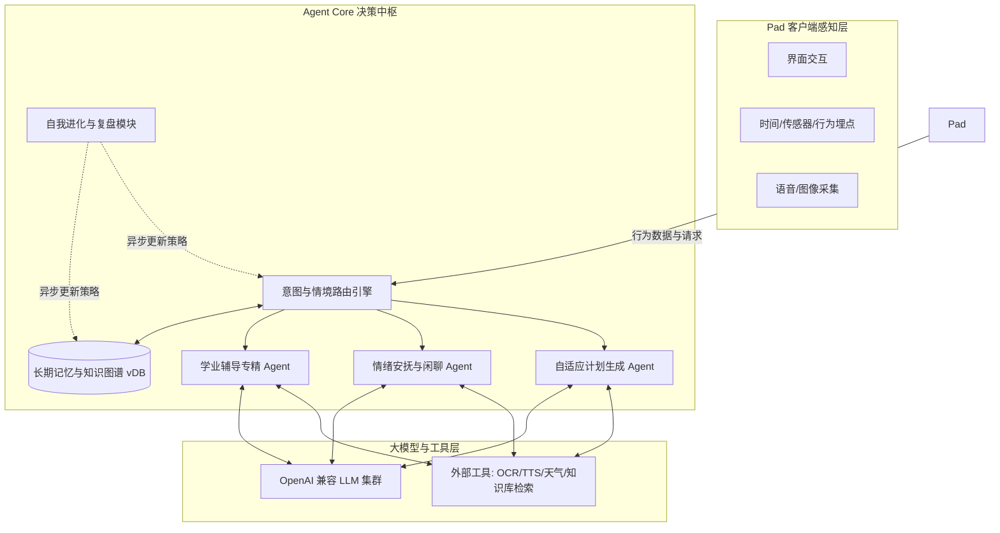

# StudyClaw 深度 Agentic 设计与智能化蓝图 (Agentic Design)

基于让 StudyClaw 具备“足够智能、自主升级、深度辅导与陪伴”的愿景，本项目在核心架构上必须超越传统的“指令-响应”模式，转而采用**主动观察 (Proactive Observation)**、**长程记忆 (Long-term Memory)** 和 **目标驱动 (Goal-Driven)** 的先进 Agent 架构。

## 1. 核心 Agentic 能力定义

### 1.1 主动观察与感知 (Proactive Observation)
StudyClaw 不应该只在被点击时才工作，它应该具备一定的时间和环境感知能力。
- **作息感知**: Agent Core 会根据 Pad 端传感器数据（如亮屏时间、设备倾斜度、使用时长）结合当前时间戳，主动判断孩子的学习状态。例如，如果晚上 9:30 孩子仍在看 Pad 里的学习资料，Agent 可以主动弹出语音：“夜深啦，小主人，今天你已经做得很棒了，我们明天再继续好吗？”
- **情绪监测 (需授权)**: 结合前置摄像头的面部表情识别（Vision API）或语音语调分析（Audio Analysis）。当检测到孩子在某道题前停留过久且眉头紧锁、或语音输入中带有烦躁情绪时，Agent 自动切入“安抚与引导”模式。

### 1.2 个性化自适应辅导 (Adaptive Tutoring)
传统的题库是静态的，而 Agentic 的辅导是动态的。
- **知识漏洞图谱**: Agent 后台持续记录孩子的错题和做题时长，构建动态的知识图谱节点。
- **动态任务生成**: 当家长只布置了“复习第二单元”这个宽泛指令时，Agent 能根据历史错题，**自主提议并生成**一份包含 5 道针对性练习题的个性化任务卡片给孩子确认。
- **苏格拉底式启发引导**: 在交互式解题时，Agent 被设定为“不直接给答案”。当孩子提问“这题怎么做”时，Agent 会反问：“我们先看看题目里提到了哪些条件呢？”引导孩子一步步思考。

### 1.3 深度情感陪伴与伙伴养成 (Emotional Companionship)
- **性格设定注入 (Persona Injection)**: 家长最初可以为 Agent 设定一个性格（如：温柔知心大姐姐、热血二次元中二伙伴、睿智的猫头鹰教授爷爷）。所有的 TTS 发音风格和 Prompt 遣词造句都会基于这个人设。
- **共情记忆链**: Agent 拥有专属的长期记忆库（如 Vector DB 存储日常对话片段）。当孩子某天提到“我今天养的蚕宝宝死掉了”，Agent 在第二天的打招呼中能主动关心：“你今天心情好点了吗？蚕宝宝去了棉花糖星，我们要带着它的份一起开心哦。”

### 1.4 自主进化与升级机制 (Autonomous Improvement)
体现 Agentic 的终极形态是它能“自己让自己变得更好”。
- **周度复盘自我进化 (Weekly Self-Reflection)**: 每周日晚，Agent Core 会在后台启动一个异步分析流，提取本周孩子对各类互动的响应率和完成度。如果发现“最近三天孩子对语音表扬的反馈变差（点击略过变快）”，Agent 会自主调整 Prompt 策略，决定下一周采用“物质积分奖励”或是“更高频的短句鼓励”来代替长篇大论。
- **家长洞察与建议推送**: Agent 会主动给家长端发送深度报告（非冰冷的数据图表，而是类似老师的诊断信）：“我注意到某某最近在分数乘法上概念依然有些模糊，建议您周末花 10 分钟陪他玩一下我们系统里推荐的‘披萨切块游戏’。”

---

## 2. Agent Workflow 架构设计

为了实现上述功能，Agent Core 内部需要设计多个协同配合的子智能体（Multi-Agent System）：

### 2.1 协同运作示例场景
**场景**：晚上 8 点，孩子刚吃完饭，打开 Pad。
1. **感知**: Sensor 捕获事件，传递给 Router。
2. **路由**: Router 读取 Memory（今日未完成数学作业 1 项，昨日错题 2 道）。分发给 `Brain_Planner`。
3. **生成**: Planner 结合当前时间，认为应该先做简单的，调用 LLM 生成话术：“晚上好呀，今天我们还有一项趣味算术挑战没完成呢，要不要现在花 15 分钟消灭它赚取 3 个币？”
4. **交互**: TTS 播报。孩子如果说“我不想做，我好累”，Media 采集语音传给 Router。
5. **切换**: Router 检测到负面情绪和消极意图，切换给 `Brain_Empathy`。
6. **安抚**: Empathy 调取记忆（他今天在学校可能有体育测验），生成回复：“是不是今天在学校跑 800 米累坏啦？稍微休息 10 分钟，我给你放一首你最喜欢的歌怎么样？”

## 3. 开发落地注意事项

1. **幻觉控制 (Hallucination Control)**: 在辅导作业时，针对数学、物理等客观题，必须引入严格的 Tool-use（如 Python 代码沙盒执行器计算结果或调用 WolframAlpha API），**绝对禁止 LLM 自己蒙答案**。
2. **隐私红线**: 涉及到情绪监测和录音，必须在家长端强制要求提供知情同意书，所有敏感原始数据“阅后即焚”，仅长期保留脱敏后的结构化情绪趋势与文本摘要。
